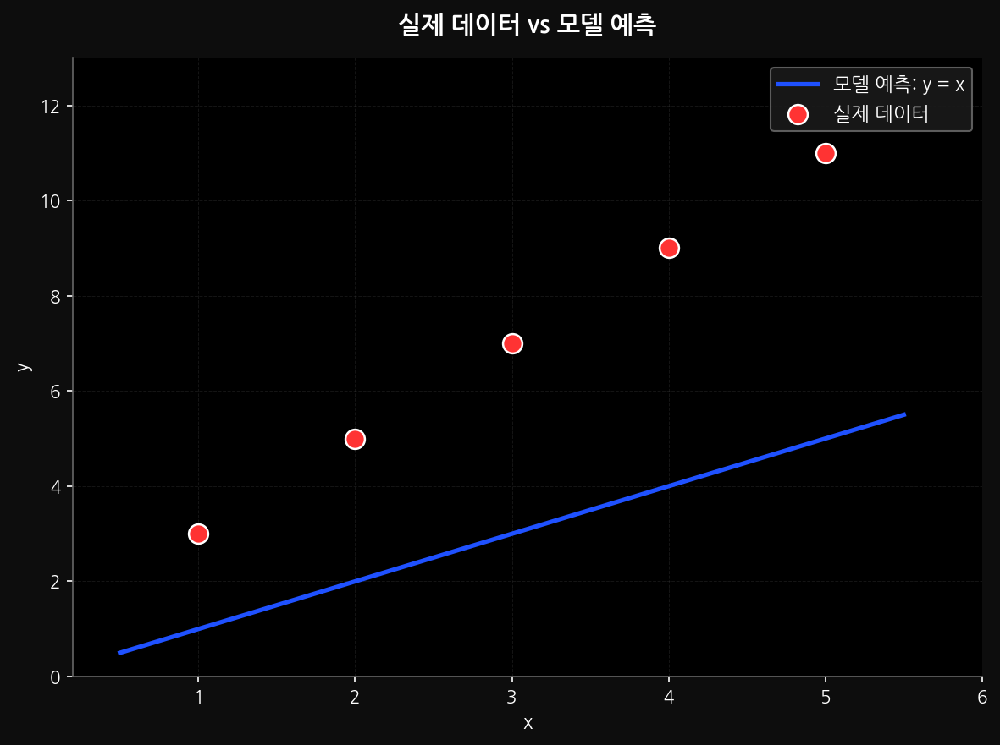
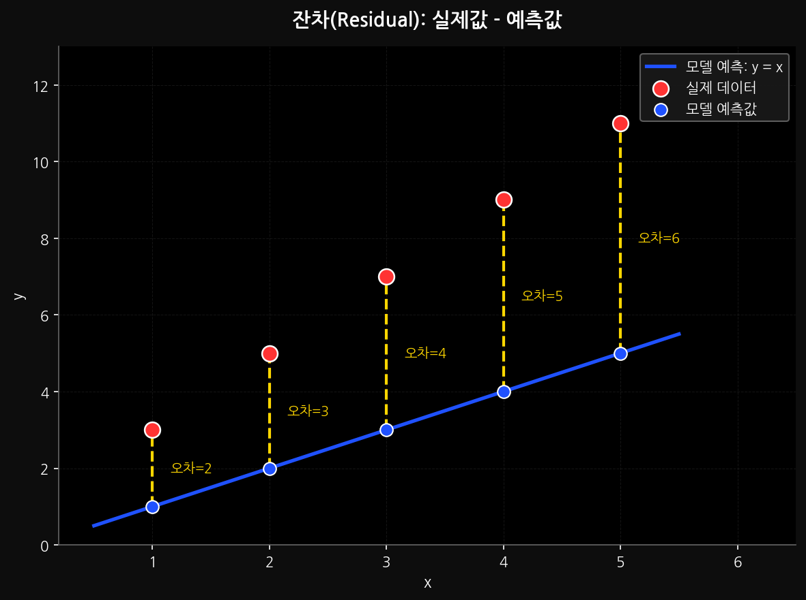
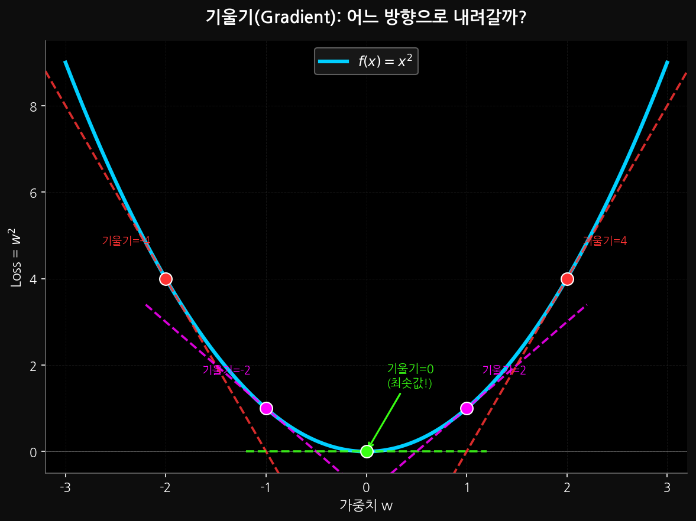
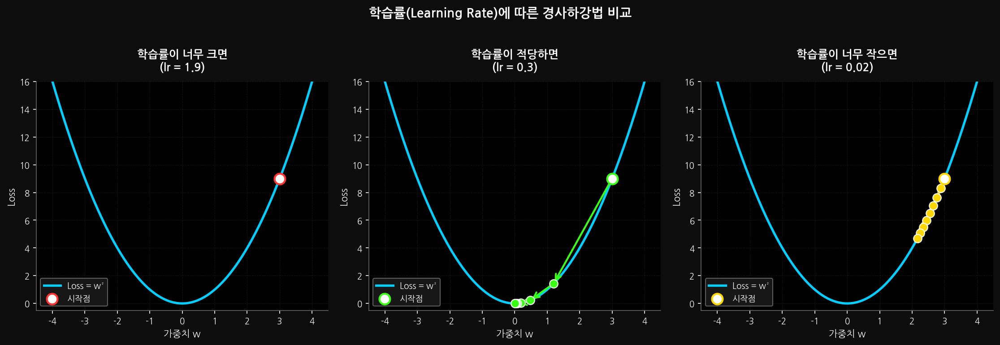
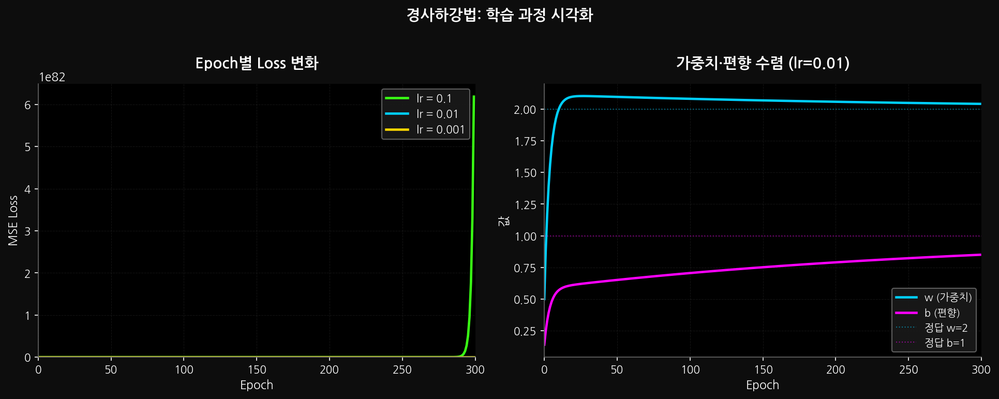

## 지난 시간 복습

1. XOR 문제 - AND나 OR는 직선으로 풀 수 있지만, XOR는 직선으로 분류할 수 없었다
2. 활성화 함수 - 척봐도 비선형인, 휘어지게 생긴 함수
3. 활성화함수(입력) = 왜곡된 출력 - 정현파를 예시로 살펴보았다
4. 다층 신경망 - 이 과정을 여러번 반복해 더할수록 더 복잡한 곡선이 나온다

# Loss란?

고등학교 때, 수학 문제 100문제를 풀고 나면 70문제는 맞고 30문제는 틀렸었다.
이 틀린 30문제는 나중에 다시 풀고 기억해서, 그 다음 100문제를 푸는 테스트에서 더 나은 75문제를 맞추었다.

이과정을 인공지능도 똑같이 한다.
먼저 100개의 데이터를 풀어본다(예측해본다).

그다음 실제 데이터 값하고 비교를 해본다.
그러면 맞은 예측이 있고, 틀린 예측이 있을 것이다.

또는 얼마나 다른지를 나타낼 수 있겠다.

예를 들어



점으로 표시된 실제 데이터와 직선으로 표현된 모델의 예측 사이에 얼마만큼 거리가 있는지 알아내면

어떤 x 값일 때 그 차이만큼 올려서 출력하면 문제가 해결되겠다.
예를 들어 5일 때는 대충 한 5정도 더 올려서 출력해, 라고 하면 오차가 줄어들지 않을까?

이 오차를 `Loss`라고 한다.
정확하게 통계학적으로는 `잔차`라고 부르는데, 오차가 단어가 쉬우니 아래에서는 오차라고 부르겠다.



# 역전파에 대한 간단한 소개

우리가 오차를 알았으니, 이제 그 오차를 보정해서 출력을 하라고 모델에게 알려주어야 할 것 이다.

이 과정을 역전파(Backward)라고 한다.

인공신경망은 여러 층으로 이루어 진다고 했다.
은닉층이 5개인 인공신경망은

입력층 - layer1 - layer2 - layer3 - layer4 - layer5 - 출력층

이런 순서를 가지고 데이터가 처리된다.
출력층에서 나온 결과값으로 오차를 측정했다!

이제 이 오차를 layer5에게 알려준다

출력층 : 너! 이만큼 보정해서 내보네!
layer5 : 보그꽌넴, 알겠습니다아. 야, layer4. 너 아래로 집합. 나 이만큼 보정한다. 알아서 맞춰
layer4 : 네 알겠습니다! layer3!!! 들었지!
layer3 : 일병, L.A.Y.ER.3! 알아들었습니다!
layer2 : ..예!
layer1 : ...!
입력층 : 그저 데이터 처리 중

# 얼마만큼 뺄 것인가의 문제

자, 이제 오차가 얼마인지는 알았다.

근데 생각해보면, 오차를 줄이는 방법이 굉장히 단순하게 들릴 수도 있다.

> "그냥 오차 계산해서 그만큼 빼면 되는 거 아닌가요?"

맞는 말이다. 근데 문제가 있다.

신경망 안에는 수천, 수만 개의 **가중치(weight)** 가 있다.
어떤 가중치를 얼마나 바꿔야 오차가 줄어드는지를 어떻게 알지?

그냥 랜덤하게 바꿔보면? 될 수도 있겠지만, 가중치가 10만 개면 경우의 수가 우주 원자 개수보다 많아진다. 현실적으로 불가능.

그러면 어떻게 해야 할까?

## 산에서 내려오는 방법

눈을 감고 산 정상에 서 있다고 생각해보자.

아무것도 안 보인다. 지도도 없다. GPS도 없다.

근데 산 아래로 내려가야 한다.

어떻게 하면 될까?

**발로 땅을 더듬어서, 경사가 내려가는 방향으로 한 발짝 내딛는다.**

이게 끝이다. 이걸 계속 반복하면?
천천히지만 결국 산 아래로 내려오게 된다.

이게 바로 **경사하강법(Gradient Descent)** 이다.

오차를 산의 높이라고 생각하자.
우리 목표는 이 오차를 최소로 만드는 것, 즉 **산에서 내려오는 것**이다.

가중치를 조금 건드려보고, 오차가 줄어드는 방향으로 가중치를 업데이트한다.
이걸 반복한다.

## 기울기(Gradient)가 뭔데



수학에서 기울기는 **미분**으로 구한다.

어떤 함수 f(x)에서 x를 아주 살짝 건드렸을 때, f(x)가 얼마나 변하는지를 나타낸 것.

> "x를 오른쪽으로 살짝 밀었더니 f(x)가 올라갔어? 그럼 왼쪽으로 가야겠다."

이게 기울기를 이용한 판단이다.

수식으로 쓰면:

$$w := w - \alpha \cdot \frac{\partial L}{\partial w}$$

겁먹지 마라. 풀어쓰면 이거다:

> **새 가중치 = 기존 가중치 - 학습률 × 오차의 기울기**

- `w` : 가중치 (우리가 조절할 값)
- `L` : Loss (오차, 줄이고 싶은 값)
- `∂L/∂w` : 가중치를 건드렸을 때 오차가 얼마나 변하는지 (기울기)
- `α` (알파) : **학습률**, 한 번에 얼마나 움직일지

## 학습률이 중요한 이유



산에서 내려올 때, 한 발짝의 크기를 학습률이라고 생각하면 된다.

**학습률이 너무 크면?**

한 발짝이 너무 커서 계곡을 훌쩍 뛰어넘어버린다.
오차가 줄기는커녕 왔다갔다 난리가 난다.
심하면 오차가 오히려 더 커진다.

```
오차: 100 → 200 → 50 → 300 → ...  ← 이거 미친 거 맞음
```

**학습률이 너무 작으면?**

발끝으로 조금씩 조금씩 내려온다.
학습이 끝나긴 하는데... 에포크(epoch, 학습 횟수)가 수십만 번 필요할 수도 있다.
기다리다 지친다.

```
오차: 100 → 99.9997 → 99.9994 → ...  ← 살아있긴 한데 언제 내려옴?
```

**적당한 학습률이면?**

```
오차: 100 → 60 → 30 → 10 → 3 → 0.5 → ...  ← 이게 맞다
```

실전에서는 `0.01`, `0.001` 같은 값을 많이 쓰고, 직접 실험해보면서 찾는다.
(나중에 학습률을 자동으로 조절해주는 옵티마이저도 배울 예정)

## 코드로 보면

```python
import numpy as np

# 데이터
x = np.array([1, 2, 3, 4, 5], dtype=float)
y = np.array([3, 5, 7, 9, 11], dtype=float)  # y = 2x + 1

# 가중치 초기화 (아무 값이나 시작)
w = 0.0
b = 0.0

lr = 0.01   # 학습률
epochs = 1000  # 반복 횟수

for epoch in range(epochs):
    # 예측
    y_pred = w * x + b

    # Loss (MSE, 평균제곱오차)
    loss = np.mean((y_pred - y) ** 2)

    # 기울기 계산
    dw = np.mean(2 * (y_pred - y) * x)
    db = np.mean(2 * (y_pred - y))

    # 가중치 업데이트
    w -= lr * dw
    b -= lr * db

    if epoch % 100 == 0:
        print(f"epoch {epoch:4d} | loss: {loss:.4f} | w: {w:.4f} | b: {b:.4f}")

print(f"\n최종 결과: y = {w:.2f}x + {b:.2f}")
```

실행하면 w가 2에, b가 1에 점점 가까워지는 걸 볼 수 있다.
데이터가 원래 y = 2x + 1 이었으니까, 모델이 정답을 찾아가는 거다.



## 정리

| 용어 | 한 줄 요약 |
|------|-----------|
| Loss | 모델이 얼마나 틀렸는지 |
| Gradient | 어느 방향으로 가중치를 바꿔야 오차가 줄어드는지 |
| 학습률 (lr) | 한 번에 얼마나 가중치를 바꿀지 |
| 경사하강법 | 오차가 줄어드는 방향으로 가중치를 조금씩 업데이트하는 방법 |

다음 시간엔 이걸 실제 신경망에 적용하는, **역전파 수식**을 제대로 파고들 예정이다.

오늘 내용이 좀 수식스러웠는데, 사실 핵심은 하나다.

> "틀린 방향으로 가고 있으면, 반대로 조금만 틀어라. 그걸 반복해라."